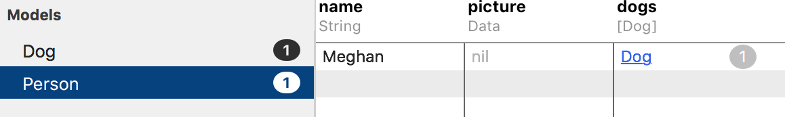
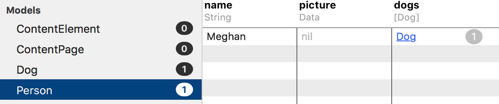
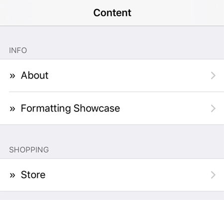
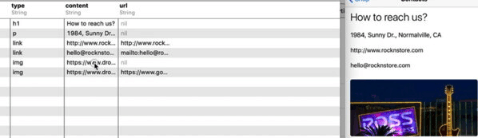
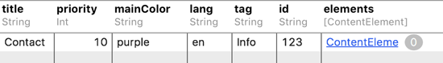
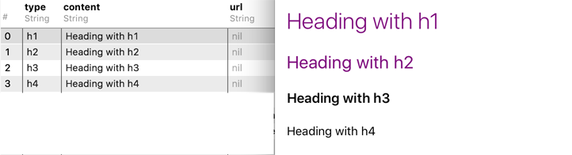
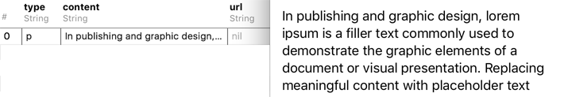
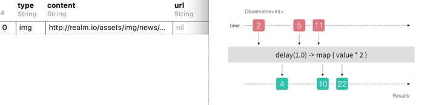
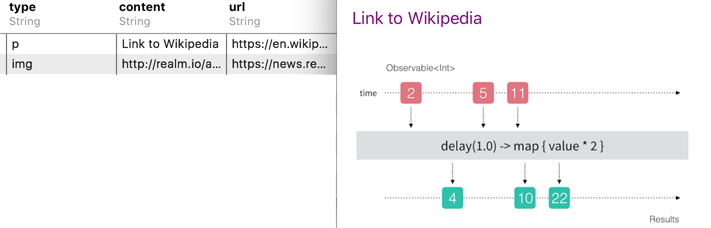

# RealmContent

[](https://travis-ci.org/icanzilb/RealmContent)
[](http://cocoapods.org/pods/RealmContent)
[](http://cocoapods.org/pods/RealmContent)
[](http://cocoapods.org/pods/RealmContent)

This library is powered by __RealmSwift__ ( [Realm Docs](https://realm.io/docs/swift/latest/) ) and automatically provides a CMS capabilities to an iOS app.

**Table of contents:**

1. Code Example
2. Usage
3. Installation
4. Credits

## Quick Showcase (~3 min)

<script src="https://fast.wistia.com/embed/medias/8dma69l12r.jsonp" async></script><script src="https://fast.wistia.com/assets/external/E-v1.js" async></script><span class="wistia_embed wistia_async_8dma69l12r popover=true popoverAnimateThumbnail=true" style="display:inline-block;height:253px;width:450px">&nbsp;</span>

## Code Example

The demo app in this repo includes a full working example of an app using RealmContent. Here's the crash-course:

**1)** Import `RealmSwift` and `RealmContent`

```swift
import RealmSwift
import RealmContent
```

Your app would normally have a list of objects it syncs from the Realm Object Server:



Once you import `RealmContent` it will expose two new models which Realm will add to your default schema.



If you're using multiple Realm files, add `ContentPage` and `ContentElement` to the desired object schema.

**2)** Create a content data source 

To display a list of the available content in your app you can use the `ContentListDataSource` class that RealmContent provides you with:

```swift
let items = ContentListDataSource(style: .sectionsByTag)
```

Use `.plain` for a plain list or `.sectionsByTag` for a list with sections.

**3)** Initialize the data source

Tell the data source, which realm you will be using (this is where, in case you have more than one, you indicate which one).

```swift
items.loadContent(from: try! Realm())
```

You can also have the data source automatically tell your table or collection view to reload the data whenever changes come in from the Realm Object Server:

```swift
items.updating(view: tableView)
```

**4)** Implement your table view or collection view data source methods like usual, but use the content data source like so:

```swift
extension ViewController: UITableViewDataSource {

    func numberOfSections(in tableView: UITableView) -> Int {
        return items.numberOfSections
    }

    func tableView(_ tableView: UITableView, numberOfRowsInSection section: Int) -> Int {
        return items.numberOfItemsIn(section: section)
    }

    func tableView(_ tableView: UITableView, titleForHeaderInSection section: Int) -> String? {
        return items.titleForSection(section: section)
    }

    func tableView(_ tableView: UITableView, cellForRowAt indexPath: IndexPath) -> UITableViewCell {
        let item = items.itemAt(indexPath: indexPath)
        let cell = tableView.dequeueReusableCell(withIdentifier: "Cell")!

        cell.accessoryType = .disclosureIndicator
        cell.textLabel?.text = "»  \(item.title ?? "...")"

        return cell
    }
}
```

This will show the list of available content. 



The next step is to show the "pages" of content on screen, which you do by presenting a custom view controller.

**5)** Presenting a content "page"

Present a `ContentViewController` instance to display content. You can do this from a table/collection view tap delegate method or from an arbitrary piece of code. Here's an example of how would it work after a tap on a table cell:

```swift
extension ViewController: UITableViewDelegate {
    func tableView(_ tableView: UITableView, didSelectRowAt indexPath: IndexPath) {
        tableView.deselectRow(at: indexPath, animated: true)

        let item = items.itemAt(indexPath: indexPath)
        let vc = ContentViewController(page: item)

        navigationController!.pushViewController(vc, animated: true)
    }
}
```

The presented view controller uses a table view to dynamically show the content from the given `ContentPage` element. In case you change the content remotely the changes will be reflected in real-time on screen. 



Which brings us to...

## Usage

You work with two types of objects `ContentPage` and `ContentElement`. The former represents a news article, blog post, product page, and whatever other content you have. The latter - a piece of content within a page, this could be a paragraph of text, a heading, a sub-heading, an image, or a link.

You can create all of this content via the Realm Browser app and update the content on all your app's client devices in real-time.

#### Pages

You can add new `ContentPage` objects via the Realm Browser or from code:



* `title` - the page title, used autom. in the content list (optional)
* `priority` - integer used to order automatically the content (optional)
* `mainColor` - an accent color for headings and links (optional)
* `lang` - used by developer to filter content by language (optional)
* `tag` - used by developer to filter content and automatically group in the content list (optional)
* `id` - used by developer to assign id to page (optional)
* `elements` - an ordered list of `ContentElements`

#### Elements

When you click (in the Realm Browser) on the _elements_ cell you will see the content elements of the content page. You can delete, add, or re-order them (via drag'n'drop).

**1)** Headings



Four levels of headings from `h1` to `h4`, which get the system heading and title font sizes, so they automatically adjust size in case your users use the usability features of iOS. The headings will automatically adopt the `mainColor` value (hex `#004433` or named color `pink`) or fallback on the `TextContentCell.defaultTextColor` color value, which you can set from code.

**2)** Text and links



An element of type `p` creates a paragraph of text.

**3)** Image



An element of type `img` fetches an image from the web and caches it locally. The image will be downscaled when wider than the view controller's view width.

**4)** Links



If you set the value of the `url` column to a valid url address, the text or image will become tappable elements and open the target url either in a safari view controller or directly in Safari (check the docs for details).

## Installation

RealmContent is available through [CocoaPods](http://cocoapods.org). To install it, simply add the following line to your Podfile:

```ruby
pod "RealmContent"
```

Alternatively, include the source code files directly into your own project.

## Credits

### License

[MIT licensed.](LICENSE)

### About


The names and logos for Realm are trademarks of Realm Inc.

We :heart: open source software!

See [our other open source projects](https://github.com/realm), read [our blog](https://realm.io/news), or say hi on twitter ([@realm](https://twitter.com/realm)).
